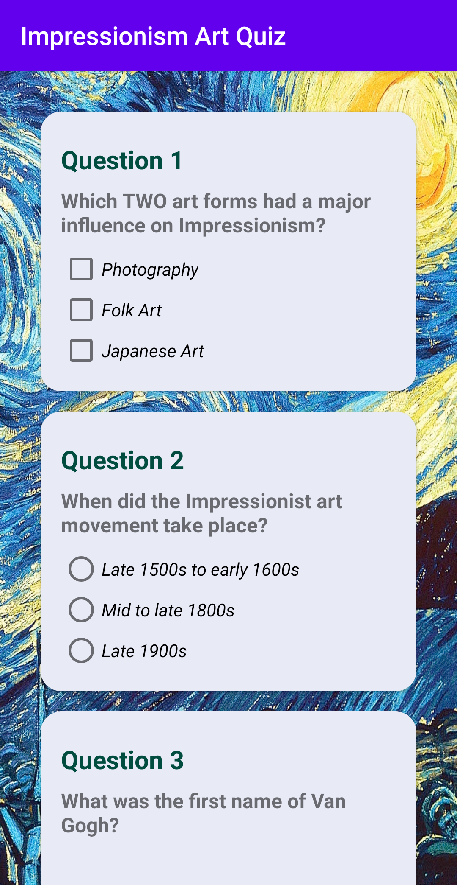
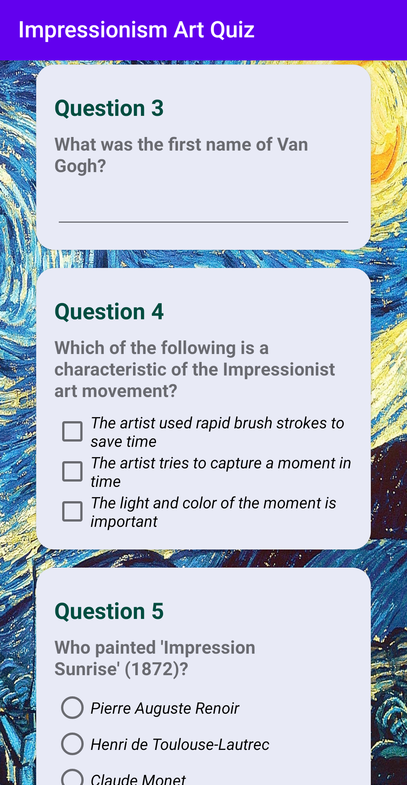
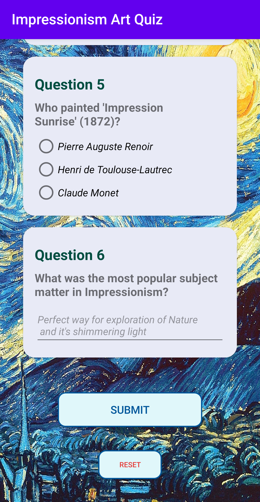

# Quizz-app
Udacity Android Basics Nanodegree Project No. 3: Quiz App

<b>PROJECT SPECIFICATION</b>

1. Simple Quiz app that contains 6 questions from Impressionism Art History. 

2. Questions are in a variety of formats such as free text response, checkboxes, and radio buttons.
   Checkboxes are only used for questions with multiple right answers. Radio buttons are only used 
   for questions with a single right answer.
   
3. - App includes a button for the user to submit their answers and receive a score.
   - App includes a button for the user to reset their answers. 

3. The code adheres to all of the following best practices:
   - Text sizes are defined in sp
   - Lengths are defined in dp
   - Padding and margin is used appropriately, such that the views are not crammed up against each other.
   - Each button’s behavior is determined by an OnClickListener in the Java code rather than by the android:onClick attribute      in the XML Layout.

#### App Images 
The below images show how the app looks like

  

